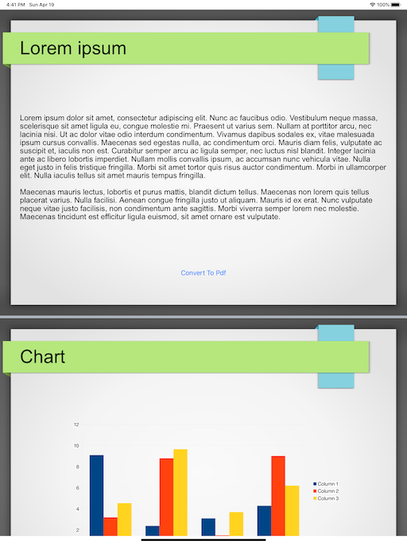
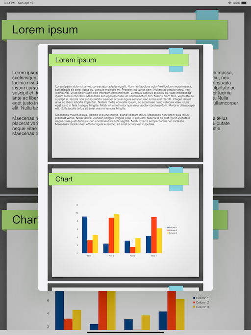

# Ppt2PdfViaWKWebView

A sample for converting PowerPoint files into `PDFDocument` via `WKWebView` .

| Original (`WKWebView`) | Converted (`PDFDocument`) |
|:--|:--|
| | |

## Requirements

* iOS 13.4+
* Xcode 11.4

## Usage

* Launch app (load sample ppt file automatically)
* Press "Convert To Pdf" button

## P.S.

I put converting logic into [MyWebView.swift](./Ppt2PdfViaWKWebView/MyWebView.swift) and [Model.swift](./Ppt2PdfViaWKWebView/Model.swift).

